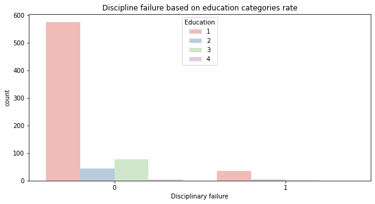
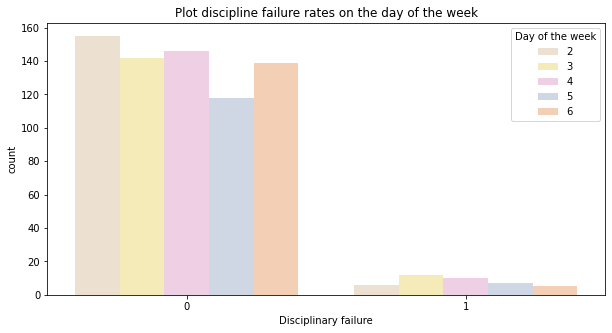
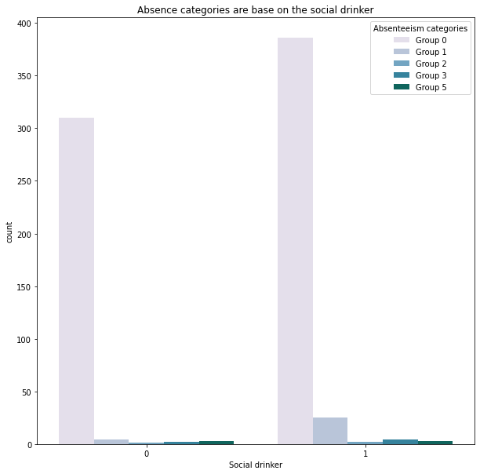
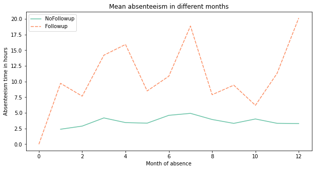
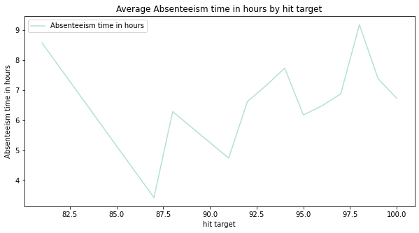
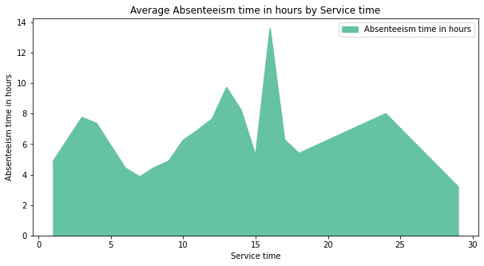
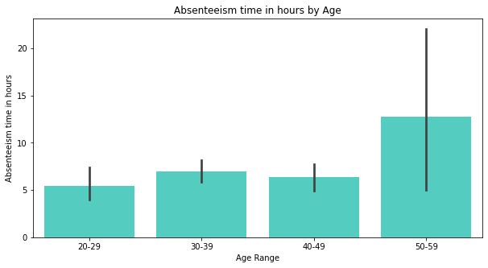

# EXPLORATORY DATA ANALYSIS FOR DATASET
Using Absenteeism at work An UCI dataset on Kaggle

## ABOUT DATASET
### ABSENTEEISM AT WORK DATASET
#### ABSTRACT
The database was created with records of absenteeism at work from July 2007 to July 2010 at a courier company in Brazil. Absenteeism at work An UCI dataset on Kaggle link data set : https://www.kaggle.com/loganalive/absenteeism-at-work-an-uci-dataset


    Data Set Characteristics  : Multivariate, Time-Series                Number of Instances   : 740 
    Attribute Characteristics : Integer, Real                            Number of Attributes  : 21
    Associated Tasks          : Classification, Clustering               Missing Values?       : N/A

#### METADATA
    Usage Information             License                     CC0: Public Domain (https://creativecommons.org/publicdomain/zero/1.0//)
                                  Visibility                  visibility Public
    
    Provenance                    Sources                     (https://archive.ics.uci.edu/ml/datasets/Absenteeism+at+work)

    Maintainers                   Dataset owner               rahul bhaskaran (https://www.kaggle.com/loganalive)

    Updates                       Expected update frequency   Never
                                  Last updated                2018-04-27                 
                                  Date created                2018-04-27                  
                                  Current version             Version 1

#### DATA SET INFORMATION
The data set allows for several new combinations of attributes and attribute exclusions, or the modification of the attribute type (categorical, integer, or real) depending on the purpose of the research.The data set (Absenteeism at work - Part I) was used in academic research at the Universidade Nove de Julho - Postgraduate Program in Informatics and Knowledge Management.

#### ATTRIBUTE INFORMATION
  1. Individual identification (ID)
  2. Reason for absence (ICD).
    
    Absences attested by the International Code of Diseases (ICD) stratified into 21 categories (I to XXI) as follows:
    
    I Certain infectious and parasitic diseases
    II Neoplasms
    III Diseases of the blood and blood-forming organs and certain disorders involving the immune mechanism
    IV Endocrine, nutritional and metabolic diseases
    V Mental and behavioural disorders
    VI Diseases of the nervous system
    VII Diseases of the eye and adnexa
    VIII Diseases of the ear and mastoid process
    IX Diseases of the circulatory system
    X Diseases of the respiratory system
    XI Diseases of the digestive system
    XII Diseases of the skin and subcutaneous tissue
    XIII Diseases of the musculoskeletal system and connective tissue
    XIV Diseases of the genitourinary system
    XV Pregnancy, childbirth and the puerperium
    XVI Certain conditions originating in the perinatal period
    XVII Congenital malformations, deformations and chromosomal abnormalities
    XVIII Symptoms, signs and abnormal clinical and laboratory findings, not elsewhere classified
    XIX Injury, poisoning and certain other consequences of external causes
    XX External causes of morbidity and mortality
    XXI Factors influencing health status and contact with health services.

    And 7 categories without (CID) 
    patient follow-up (22), 
    medical consultation (23), 
    blood donation (24), 
    laboratory examination (25), 
    unjustified absence (26), 
    physiotherapy (27), 
    dental consultation (28).
        
  3. Month of absence
  4. Day of the week (Monday (2), Tuesday (3), Wednesday (4), Thursday (5), Friday (6))
  5. Seasons (summer (1), autumn (2), winter (3), spring (4))
  6. Transportation expense
  7. Distance from Residence to Work (kilometers)
  8. Service time
  9. Age
  10. Work load Average/day
  11. Hit target
  12. Disciplinary failure (yes=1; no=0)
  13. Education (high school (1), graduate (2), postgraduate (3), master and doctor (4))
  14. Son (number of children)
  15. Social drinker (yes=1; no=0)
  16. Social smoker (yes=1; no=0)
  17. Pet (number of pet)
  18. Weight
  19. Height
  20. Body mass index
  21. Absenteeism time in hours (target)

#### RELEVANT PAPERS
Martiniano, A., Ferreira, R. P., Sassi, R. J., & Affonso, C. (2012). Application of a neuro fuzzy network in prediction of absenteeism at work. In Information Systems and Technologies (CISTI), 7th Iberian Conference on (pp. 1-4). IEEE.

#### CITATION REQUEST
Martiniano, A., Ferreira, R. P., Sassi, R. J., & Affonso, C. (2012). Application of a neuro fuzzy network in prediction of absenteeism at work. In Information Systems and Technologies (CISTI), 7th Iberian Conference on (pp. 1-4). IEEE.

#### ACKNOWLEDGEMENTS
- Professor Gary Johns for contributing to the selection of relevant research attributes.
- Professor Emeritus of Management
- Honorary Concordia University Research Chair in Management
- John Molson School of Business
- Concordia University
- Montreal, Quebec, Canada
- Adjunct Professor, OB/HR Division
- Sauder School of Business,
- University of British Columbia
- Vancouver, British Columbia, Canada

## OBJECTIVES

The purpose of this notebook is to collect data for exploratory data analysis.

Formulate the data by compiling and divided the data into two, namely categorical data and continuous data. That makes it easier to visualize.


## PROGRAMMING WITH PYTHON

### DATA PREPARATION
- Import Dataset from Kaggle
- Import Libraries

### EXPLORATORY DATA ANALYSIS
- Check Dimensions of data
- Check Data type for each attribute
- Check Null values in dataset
- Check Correlation. The most common method for calculating correlation is Pearson’s Correlation Coefficient, that assumes a normal distribution of the attributes involved. A correlation of -1 or 1 shows a full negative or positive correlation respectively. Whereas a value of 0 shows no correlation at all. The matrix lists all attributes across the top and down the side, to give correlation between all pairs of attributes (twice, because the matrix is symmetrical). There can show the diagonal line through the matrix from the top left to bottom right corners of the matrix shows perfect correlation of each attribute with itself.
- The skew result show a positive (right) or negative (left) skew. Values closer to zeroshow less skew.
- Add categorical target column as per project requires 
- Formatting to proper data type
- Store two datasets, one for continous and other categorical

## RESULTS




```
Education Categories

1  High School
2  Graduate 
3  Postgraduate 
4  Master and Doctor

```
From the plot, it can show that the high school category has the highest score for undisciplined. Then the ranking is followed by the postgraduate education category.

___





```
Day of the week categories

2  Monday 
3  Tuesday 
4  Wednesday 
5  Thursday 
6  Friday
```
Mostly, the undiscipline numbers come from the day of the week. 

___




```
Absenteeism categories

Group 0 		0-20 hours
Group 1 		21-40 hours
Group 2 		41-60 hours
Group 3 		61-80 hours
Group 4 		81-100 hours
Group 5 		101-120 hours
```

Group 0, which has an absence time of 0 to 20 hours, is a group dominated by social drinkers active.


____



Followup is the attribute result of the absence reason category aggregation. The NoFollowup is an attribute without reasons for absence.
From the line plot, that appears that absence is in the category attribute of reasons for absences.

____



The average number of absentee numbers fluctuates with the achievement of a company's target. The lowest number of target achievements is the percentage of less than 80.

____



Based on this graph, the highest absenteeism is between 15 hours and 20 hours of service time.

____


The highest mean number of absences per hour found among employees with three children.

____



The 50-59 year age group has the highest number of hours of absenteeism amongst others.

